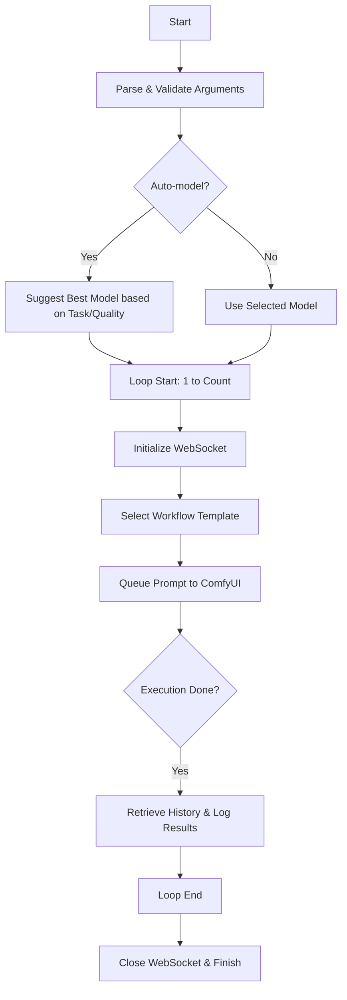

# generate_image.py

## Purpose
The `generate_image.py` script is a versatile tool for generating high-quality visual assets using a ComfyUI server. It is optimized for hardware like the RTX 3060 12GB and supports various tasks including text-to-image, text-to-video, and guided "paint-by-numbers" generation.

## Usage
Run the script from the command line with a prompt and desired task options.

```bash
python3 generate_image.py "your prompt here" [options]
```

## Core Tasks (`--task`)

### Text to Image (`text-to-image`)
Generates an image from a text prompt.
- **Models**: `sd15` (balanced), `flux-klein-4b` (high quality), `sdxl` (high quality alternative).
- **Optimization**: Use `--quality high` to enable high-resolution upscaling.

### Paint by Numbers (`paint-by-numbers`)
Uses an input image (sketch or scribble) to guide the generation.
- **Requirement**: Must provide `--image path/to/sketch.png`.
- **Model**: Defaults to `sd15` with ControlNet Scribble.

### Text to Video (`text-to-video`)
Generates a short video clip from a text prompt.
- **Model**: `svd`.

### Image to Video (`image-to-video`)
Animates a static input image into a video.
- **Requirement**: Must provide `--image path/to/image.png`.
- **Model**: `svd`.

## Input Parameters

### Positional Arguments
- `prompt`: The text description of the asset you want to generate.

### Optional Arguments
- `--task`: (Default: `text-to-image`) Task to perform. Options: `text-to-image`, `text-to-video`, `image-to-video`, `paint-by-numbers`.
- `--quality`: (Default: `balanced`) Quality preference. `high` enables upscaling for images.
- `--count`: (Default: `1`) Number of assets to generate. Useful for "set and forget" overnight runs.
- `--auto-model`: Flag to automatically select the best model for the selected task and quality.
- `--image`: Path to an input image (required for `image-to-video` and `paint-by-numbers`).
- `--name`: Prefix for the output filename.
- `--width/--height`: Dimensions for the generation.
- `--model`: Manually specify the model architecture (`sd15`, `flux-klein-4b`, `svd`, `sdxl`).
- `--steps/--cfg`: Manual overrides for sampling steps and guidance scale.

## Hardware Optimization (RTX 3060 12GB)
- **Flux.2 Klein 4B**: Highly recommended for high-quality images. It fits comfortably in 12GB VRAM and provides superior detail.
- **Batching**: Use the `--count` parameter to queue many jobs. The script handles sequential execution, making it perfect for overnight processing.
- **Upscaling**: Enabling `--quality high` adds a post-production upscaling step (using 4x-UltraSharp) to improve final output resolution and clarity.

## Example Usage Commands

### High-Quality Overnight Batch
Generate 10 high-quality images using the best model:
```bash
python3 generate_image.py "A futuristic garden" --task text-to-image --quality high --auto-model --count 10
```

### Paint by Numbers
```bash
python3 generate_image.py "A vibrant oil painting of a cat" --task paint-by-numbers --image my_sketch.png
```

### Image Animation
```bash
python3 generate_image.py --task image-to-video --image portrait.png
```

## Workflow Diagram


