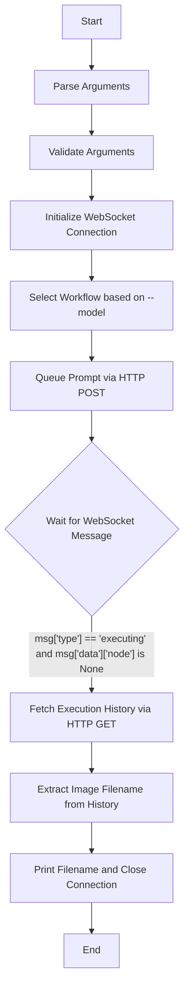

# generate_image.py

## Purpose
The `generate_image.py` script automates the process of generating images using a ComfyUI server. It interfaces with the ComfyUI API to queue prompts, monitor their execution progress via WebSockets, and retrieve information about the generated assets.

## Usage
Run the script from the command line, providing at least a text prompt.

```bash
python3 generate_image.py "your prompt here" [options]
```

## Input Parameters

### Positional Arguments
- `prompt`: The text description of the image you want to generate.

### Optional Arguments
- `--name`: (Default: `evergreen`) Prefix for the output filename on the server.
- `--width`: (Default: `512`) The width of the generated image.
- `--height`: (Default: `896`) The height of the generated image. Recommended vertical resolution for SD 1.5.
- `--server`: (Default: `127.0.0.1:8188`) The address of the ComfyUI server. Can also be set via the `COMFYUI_ADDRESS` environment variable.
- `--model`: (Default: `sd15`) Model architecture to use. Options: `sd15`, `flux-klein-4b`.
- `--steps`: (Default: depends on model) Number of sampling steps. (SD1.5: 20, Flux: 4)
- `--cfg`: (Default: depends on model) Classifier Free Guidance scale. (SD1.5: 8.0, Flux: 1.0)

## Model Architectures

### Stable Diffusion 1.5 (`sd15`)
- **Checkpoint**: `v1-5-pruned-emaonly-fp16.safetensors`
- **Default Steps**: 20
- **Default CFG**: 8.0
- **Use Case**: General purpose generation, legacy support.

### Flux.2 Klein 4B (`flux-klein-4b`)
- **Checkpoint**: `flux-2-klein-4b-fp8.safetensors`
- **Default Steps**: 4
- **Default CFG**: 1.0
- **Use Case**: High-speed, high-quality generation optimized for RTX 3060 12GB.

## Output
- **Console Output**: Prints the seed used, progress updates, and the final filename of the generated image.
- **Server Output**: Creates an image file in the ComfyUI server's output directory.
- **Log Output**: Records execution details and errors in `asset_gen.log`.

## Dependencies and Requirements
- **Python 3.x**
- **Required Packages**:
    - `websocket-client` (can be installed via `pip install websocket-client`)
- **Standard Library Modules**: `uuid`, `json`, `urllib`, `argparse`, `sys`, `random`, `os`, `logging`.
- **Project Modules**: `error_handler.py`.
- **ComfyUI Server**: A running instance of ComfyUI reachable at the specified server address.

## Example Usage Commands

### Basic Generation
```bash
python3 generate_image.py "A mystical forest with glowing mushrooms"
```

### Custom Dimensions and Filename
```bash
python3 generate_image.py "A futuristic cityscape" --width 768 --height 512 --name scifi_city
```

### Specifying a Remote Server
```bash
python3 generate_image.py "A cute robot" --server 192.168.1.50:8188
```

### Using Flux.2 Klein 4B
```bash
python3 generate_image.py "A high-tech laboratory" --model flux-klein-4b
```

## Workflow Diagram


